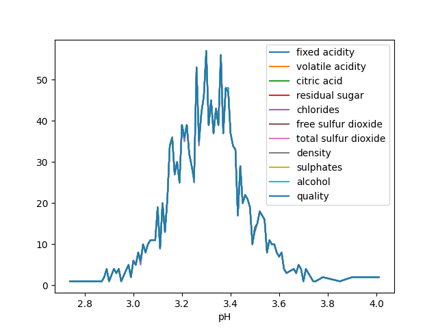
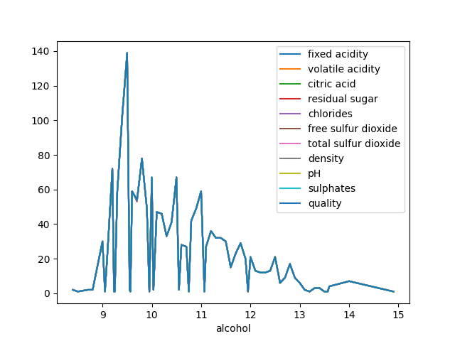
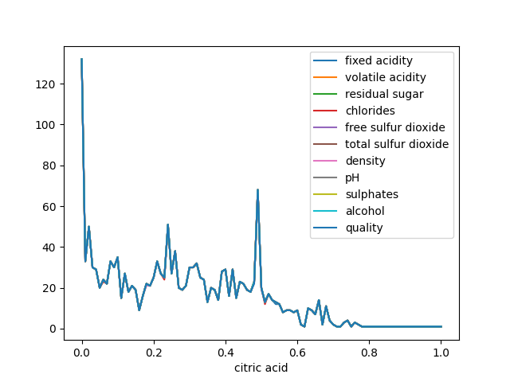
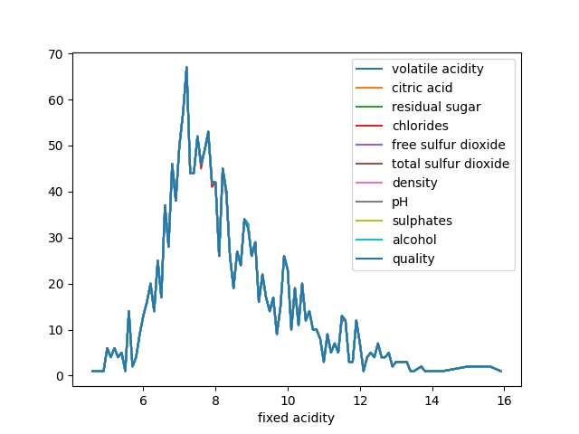

### Report
---

The "report on red-wine.csv" dataset provides valuable insights into the characteristics and quality of red wines. This dataset contains information on various chemical properties such as acidity, volatile acidity, citric acid, and residual sugar, as well as quality ratings ranging from 1 to 10.  Comprehending the significance of these variables can aid in understanding the factors that contribute to the overall quality of red wines. By analyzing the dataset, it becomes apparent that certain chemical properties have a significant impact on the quality of red wines. For example, acidity levels, particularly volatile acidity, can greatly influence the taste and overall desirability of a wine. Wines with lower levels of volatile acidity are usually considered of higher quality. Comprehending the relationship between these chemical properties and the quality ratings in the dataset allows for a deeper understanding of the factors that contribute to the overall enjoyment of red wines. 

This graph shows the effects of the ph and how it affects and relates to the density of the wine. It can be seen that for higher levels of pH, the density of the wine reduces. This means that the pH and the density are in indirect proportion.

This graph shows the effects of the alcohol content and how it affects the quality of the wine. Wine should be of a relatively high amount of alcohol but should still obtain it,s optimum quality. The graph therefore shows the the alcohol content and the quality of the wine are in direct proportion and this means that the higher the alcohol content the better the quality of the wine.

This graph also shows another directly proportional relationship between citric acis and residual sugar. The residual sugar is from fermented grapes and since those are also essential in the production of red wine, they must be of high values to give the wine its distinct taste supported by a proportional amount of citric acid to also add its effect to the wine.

Finally, this graph shows the effect the fixed acidity has on the choloride acitivity. These two parameters are also in direct proportion and hence a higher value of one yields in an increase in value of the other.

